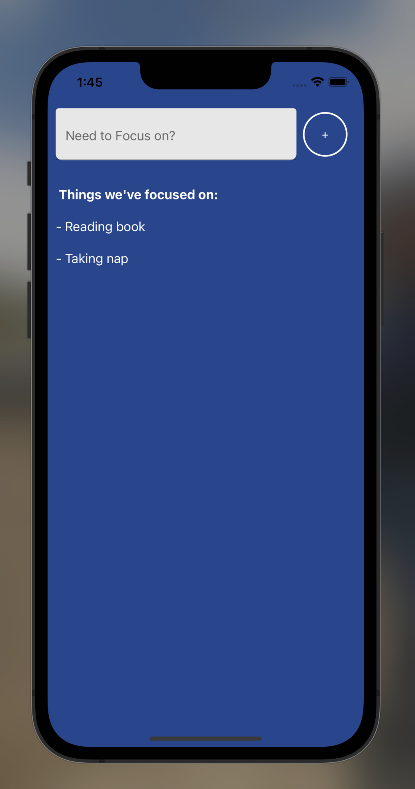
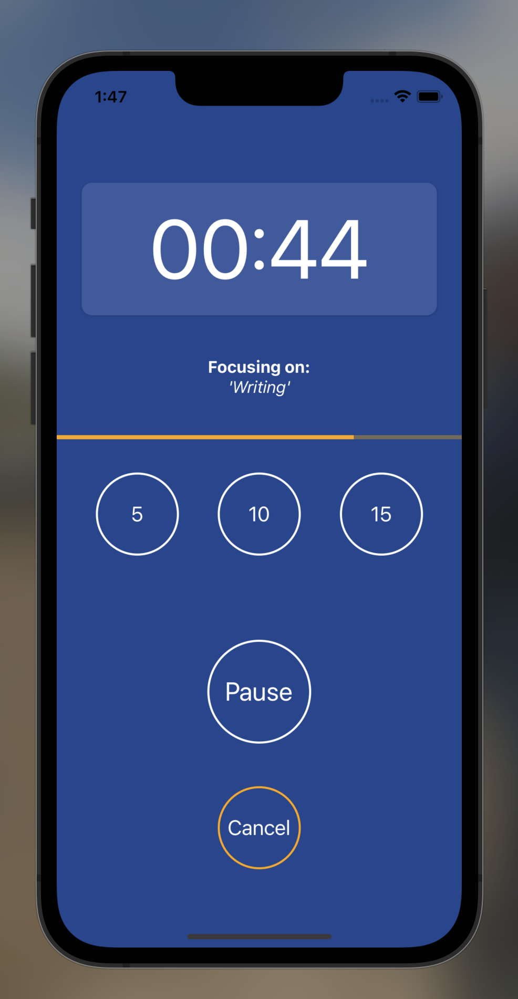

# FocusApp in React Native, [iOS], and [Android]


run 
```
yarn or npm i
expo run
```
then boom you will have my code running on your local


**_ Functionality _**

This App can be used to focus on multiple things and when the time ends it will simply ```vibrates``` six times to indicate the user.

You can modify the time or cancel the focus time at any moment.

## Reference Pictures


